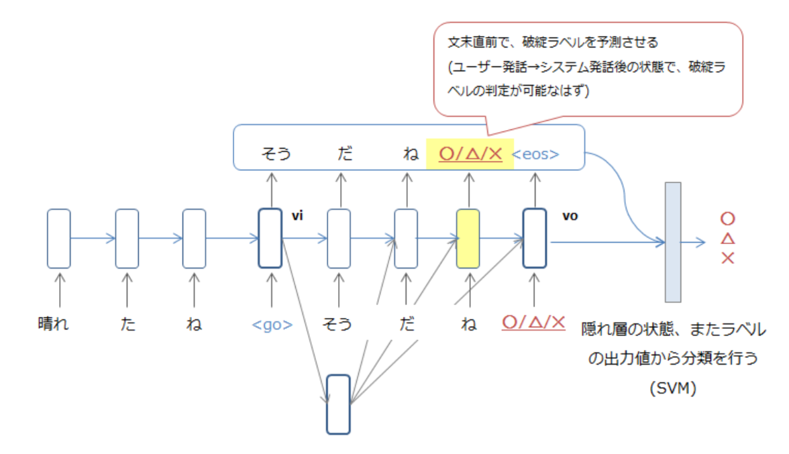

# DialogueBreakdownDetection2016

2016年度の対話破綻検出チャレンジの提出モデル

## Model

* ベースとして、Neural Conversational Model(以下NCM)を使用
* システム発話の末尾に、対話破綻ラベルを付与し「発話」と「破綻」を同時に学習・予測させる
* 最終的な分類は、NCMの隠れ層、また出力値の値を特徴量としたSVMで分類を行う
* 破綻ラベルは、アノテーターの確率分布に基づき挿入する。これにより、同じ対話データから(分布に基づく)複数の学習データを生成できる

モデルの詳細、また結果については論文をご参照ください。

## Dependencies

* TensorFlow
* scikit-learn
* MeCab

## How to Train/Run

リポジトリの中には、以下3種類のモデルを含んでいます。

* baseline: 普通にNCMを学習し、分類を行ったもの
* proposal
 * conscious rnn: 提案モデル。末尾に対話破綻ラベルを付与
 * vector rnn: 入力に分散表現を使用。分散表現は、[fastText](https://github.com/facebookresearch/fastText)を日本語Wikipediaで学習させたものを使用。

実行する場合は、`run`のフォルダを利用します。なお、学習済みのモデルを`/data/trained_model`に格納しています。これらは`git lfs`で保存しています。
簡単な手順は以下の通りです。

0. 必要ライブラリをインストールし、実行環境を整える
1. `/data/trained_model`からモデルに合ったファイルを選択(conscious/vector)
2. 学習済みモデルファイルを解凍して得られる`store`フォルダを、`run/conscious_rnn`、または`run/vector_rnn`に配置(種別に合わせる)
3. `run_xxxx.py`ファイルを実行する。パラメーターなどについては、`-h`でヘルプが出力されますので、そちらを参照してください。

